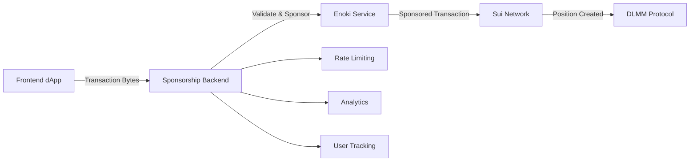

# **🚀 Sui DLMM Enoki Sponsorship Backend**

[](https://nodejs.org/)
[](https://www.typescriptlang.org/)
[](https://expressjs.com/)
[](https://docs.enoki.mystenlabs.com/)
[](https://sui.io/)
[](https://opensource.org/licenses/MIT)
[](#)
[](#)

> **Gasless DeFi Backend** - Sponsor liquidity position creation on Sui DLMM Protocol using Enoki's transaction sponsorship. Enable Web2-like user experiences in DeFi without gas fee barriers.

## 🌟 **Features**

- **🎯 Position Sponsorship** - Sponsor DLMM liquidity position creation for users
- **⚡ Zero Gas Fees** - Users create positions without paying transaction costs  
- **🔐 Smart Validation** - Validate transactions target legitimate DLMM operations
- **📊 Usage Tracking** - Monitor sponsorship costs and user limits
- **🛡️ Abuse Prevention** - Rate limiting and eligibility checks
- **📈 Analytics Dashboard** - Track sponsored transactions and user acquisition
- **🔄 Real-time Integration** - Works with any frontend using Sui DLMM SDK

## 🏗️ **Architecture**



## 🚀 **Quick Start**

### Prerequisites

- **Node.js** 18+ 
- **npm** or **yarn**
- **Enoki API Key** (from [Enoki Dev Portal](https://enoki.mystenlabs.com/))
- **Deployed Sui DLMM Contracts** on testnet

### Installation

```bash
# Clone the repository
git clone https://github.com/your-org/sui-dlmm-enoki.git
cd sui-dlmm-enoki

# Install dependencies
npm install

# Copy environment template
cp .env.example .env
```

### Environment Configuration

```bash
# .env
ENOKI_PRIVATE_KEY=your_enoki_secret_key_here

# Sui DLMM Contract Addresses
DLMM_PACKAGE_ID=0x6a01a88c704d76ef8b0d4db811dff4dd13104a35e7a125131fa35949d0bc2ada
DLMM_FACTORY_ID=0x160e34d10029993bccf6853bb5a5140bcac1794b7c2faccc060fb3d5b7167d7f
TEST_USDC_TREASURY=0x2270d37729375d0b1446c101303f65a24677ae826ed3a39a4bb9c744f77537e9

# Server Configuration
PORT=3001
NODE_ENV=development
SUI_NETWORK=testnet
```

### Run the Server

```bash
# Development mode (with auto-reload)
npm run dev

# Production mode
npm run build
npm start
```

Server will start at `http://localhost:3001` 🎉

## 📡 **API Endpoints**

### Health Check
```http
GET /health
```

**Response:**
```json
{
  "status": "ok",
  "message": "DLMM Enoki sponsor service is running",
  "dlmmConfig": {
    "packageId": "0x6a01...",
    "factoryId": "0x160e..."
  }
}
```

### Sponsor Position Creation
```http
POST /api/sponsor-position
```

**Request Body:**
```json
{
  "transactionKindBytes": "0x123abc...",
  "sender": "0xb0be34d2874c522577ed7f49e6c11a12f5d550da871cd9a31f11e1f86d9da988",
  "poolId": "0x456def...",
  "tokenA": "0x6a01...::test_usdc::TEST_USDC",
  "tokenB": "0x2::sui::SUI",
  "positionValueUSD": 150,
  "network": "testnet"
}
```

**Success Response:**
```json
{
  "success": true,
  "bytes": "0xsponsored_transaction_bytes...",
  "digest": "0xtransaction_digest...",
  "message": "Position creation sponsored successfully",
  "sponsorshipInfo": {
    "gasFeeCovered": true,
    "estimatedSavings": "$0.05-0.10",
    "remainingLimits": {
      "dailyPositions": 2,
      "monthlyPositions": 9,
      "totalSponsorshipValueUSD": 49.92
    }
  }
}
```

### Execute Sponsored Transaction
```http
POST /api/execute-position
```

**Request Body:**
```json
{
  "digest": "0xtransaction_digest...",
  "signature": "0xuser_signature..."
}
```

### Analytics Dashboard
```http
GET /api/sponsorship-stats
```

**Response:**
```json
{
  "analytics": {
    "totalUsers": 47,
    "totalPositionsSponsored": 156,
    "totalValueSponsored": 12.48,
    "averagePerUser": 0.27
  },
  "config": {
    "PACKAGE_ID": "0x6a01...",
    "FACTORY_ID": "0x160e...",
    "ALLOWED_MODULES": ["position", "position_manager"],
    "ALLOWED_FUNCTIONS": ["create_position", "create_position_simple"]
  }
}
```

## 🔧 **Integration Guide**

### Frontend Integration

```typescript
// React/Next.js Integration Example
import { DLMMClient } from 'sui-dlmm-sdk';

const useSponsoredPosition = () => {
  const createSponsoredPosition = async (positionParams) => {
    // 1. Build transaction with Sui DLMM SDK
    const dlmmClient = new DLMMClient({ network: 'testnet', suiClient });
    const txBytes = await dlmmClient.positions.buildCreatePositionTransaction(
      positionParams,
      coinAObject,
      coinBObject
    );

    // 2. Request sponsorship from this backend
    const sponsorResponse = await fetch('/api/sponsor-position', {
      method: 'POST',
      headers: { 'Content-Type': 'application/json' },
      body: JSON.stringify({
        transactionKindBytes: Array.from(txBytes),
        sender: userWalletAddress,
        poolId: positionParams.poolId,
        tokenA: positionParams.tokenA,
        tokenB: positionParams.tokenB,
        positionValueUSD: calculatePositionValue()
      })
    });

    const sponsorResult = await sponsorResponse.json();

    if (sponsorResult.success) {
      // 3. Execute sponsored transaction (user signs, sponsor pays gas)
      const executeResponse = await fetch('/api/execute-position', {
        method: 'POST',
        headers: { 'Content-Type': 'application/json' },
        body: JSON.stringify({
          digest: sponsorResult.digest,
          signature: await getUserSignature(sponsorResult.bytes)
        })
      });

      return await executeResponse.json();
    }
  };

  return { createSponsoredPosition };
};
```

### CLI Testing

```bash
# Test position sponsorship
curl -X POST http://localhost:3001/api/sponsor-position \
  -H "Content-Type: application/json" \
  -d '{
    "transactionKindBytes": "real_tx_bytes_from_dlmm_sdk",
    "sender": "0xb0be34d2874c522577ed7f49e6c11a12f5d550da871cd9a31f11e1f86d9da988",
    "poolId": "0x160e34d10029993bccf6853bb5a5140bcac1794b7c2faccc060fb3d5b7167d7f",
    "tokenA": "0x6a01a88c704d76ef8b0d4db811dff4dd13104a35e7a125131fa35949d0bc2ada::test_usdc::TEST_USDC",
    "tokenB": "0x2::sui::SUI",
    "positionValueUSD": 150
  }'
```

## 🛡️ **Security & Validation**

### Transaction Validation
- ✅ **Contract Targeting** - Only allows calls to your DLMM contracts
- ✅ **Function Whitelist** - Restricts to position creation functions
- ✅ **Parameter Validation** - Validates pool IDs, token types, amounts
- ✅ **User Authorization** - Ensures users can only affect their own assets

### Rate Limiting
```typescript
// Default Sponsorship Limits
const SPONSORSHIP_LIMITS = {
  dailyPositions: 3,        // Max 3 sponsored positions per day
  monthlyPositions: 10,     // Max 10 sponsored positions per month
  totalValueUSD: 50,        // Max $50 worth of gas sponsored
  newUserGrace: true        // First position always sponsored
};
```

### Abuse Prevention
- **User Tracking** - Monitor sponsorship usage per address
- **Value Thresholds** - Always sponsor high-value positions (>$100)
- **Pattern Detection** - Flag suspicious rapid-fire requests
- **Eligibility Checks** - Verify transaction legitimacy before sponsoring

## 📊 **Business Model Features**

### Sponsorship Strategies

| User Tier | Daily Limit | Monthly Limit | Special Rules |
|-----------|-------------|---------------|---------------|
| **New User** | 3 positions | 10 positions | First position always sponsored |
| **Regular** | 3 positions | 10 positions | Standard limits apply |
| **High Value** | Unlimited | Unlimited | Positions >$100 always sponsored |
| **Premium** | Unlimited | Unlimited | Paid tier - all gas covered |

### Cost Management
- **Real-time Tracking** - Monitor total sponsorship costs
- **Budget Controls** - Set daily/monthly sponsorship budgets  
- **ROI Analytics** - Track user acquisition cost vs lifetime value
- **Automated Limits** - Circuit breakers for cost control

## 🔧 **Configuration**

### Sponsorship Rules
```typescript
// Customize sponsorship eligibility in index.ts
const checkSponsorshipEligibility = async (userAddress, positionValueUSD) => {
  // New users - always sponsor first position
  if (isNewUser(userAddress)) {
    return { eligible: true, reason: 'New user onboarding' };
  }
  
  // High-value positions - always sponsor
  if (positionValueUSD > 100) {
    return { eligible: true, reason: 'High-value position' };
  }
  
  // Check daily/monthly limits
  return checkLimits(userAddress);
};
```

### Contract Configuration
```typescript
// Update contract addresses in index.ts
const DLMM_CONFIG = {
  PACKAGE_ID: "your_deployed_package_id",
  FACTORY_ID: "your_deployed_factory_id",
  ALLOWED_MODULES: ['position', 'position_manager'],
  ALLOWED_FUNCTIONS: ['create_position', 'create_position_simple']
};
```

## 📈 **Monitoring & Analytics**

### Available Metrics
- **User Acquisition** - New users onboarded via sponsorship
- **Position Creation** - Total sponsored positions created
- **Cost Tracking** - Total gas fees sponsored (USD)
- **Success Rate** - Successful sponsorships vs failures
- **User Retention** - Users creating multiple positions

### Analytics API
```bash
# Get comprehensive sponsorship analytics
curl http://localhost:3001/api/sponsorship-stats

# Response includes user count, total costs, success metrics
```

## 🚀 **Deployment**

### Production Deployment

```bash
# Build for production
npm run build

# Start production server
npm start

# Or use PM2 for process management
npm install -g pm2
pm2 start dist/index.js --name "dlmm-sponsor"
```

### Docker Deployment

```dockerfile
FROM node:18-alpine
WORKDIR /app
COPY package*.json ./
RUN npm ci --only=production
COPY . .
RUN npm run build
EXPOSE 3001
CMD ["npm", "start"]
```

```bash
# Build and run Docker container
docker build -t sui-dlmm-enoki .
docker run -p 3001:3001 --env-file .env sui-dlmm-enoki
```

### Environment Variables

| Variable | Description | Required |
|----------|-------------|----------|
| `ENOKI_PRIVATE_KEY` | Enoki API secret key | ✅ Yes |
| `DLMM_PACKAGE_ID` | Your DLMM contract package ID | ✅ Yes |
| `DLMM_FACTORY_ID` | Your DLMM factory contract ID | ✅ Yes |
| `PORT` | Server port (default: 3001) | ❌ No |
| `NODE_ENV` | Environment (development/production) | ❌ No |
| `SUI_NETWORK` | Sui network (testnet/mainnet) | ❌ No |

## 🤝 **Contributing**

We welcome contributions! Please see our [Contributing Guide](CONTRIBUTING.md) for details.

### Development Setup
```bash
git clone https://github.com/your-org/sui-dlmm-enoki.git
cd sui-dlmm-enoki
npm install
npm run dev
```

### Code Style
- TypeScript for all code
- ESLint + Prettier for formatting
- Comprehensive error handling
- Detailed logging for debugging

## 📄 **License**

This project is licensed under the MIT License - see the [LICENSE](LICENSE) file for details.

## 🙏 **Acknowledgments**

- [Mysten Labs](https://mystenlabs.com/) for Enoki transaction sponsorship infrastructure
- [Sui Foundation](https://sui.io/) for the incredible blockchain platform
- [DLMM Community](https://github.com/your-org/sui-dlmm-sdk) for protocol development
- All contributors and users making gasless DeFi possible

---

**🚀 Built for the future of DeFi user experience - where gas fees don't exist!**

[](#)
[](https://sui.io/)
[](https://docs.enoki.mystenlabs.com/)